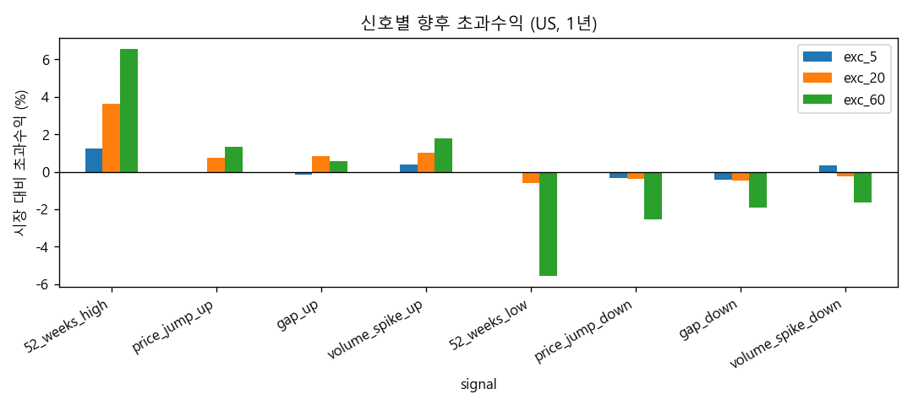
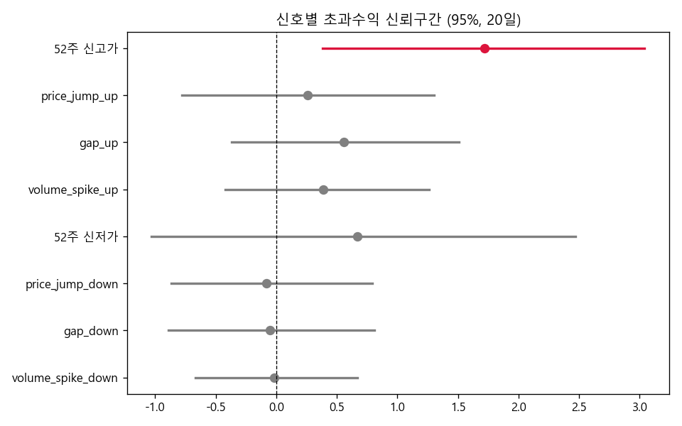
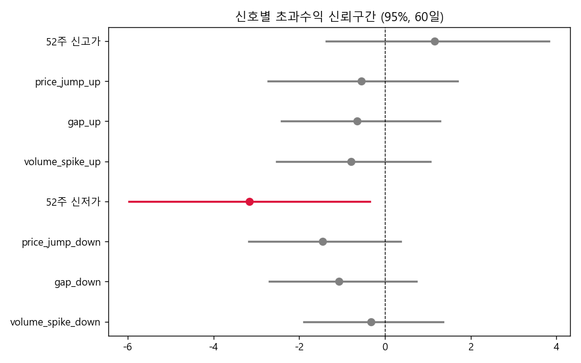

# WhyMove
한국·미국 주식의 주가·거래량·수급 변동 이상치를 탐지하고, 그 발생 원인을 뉴스와 공시·재무로 자동 추적해 분석 메모를 제공하여 투자 의사결정에 도움을 주는 멀티 에이전트 모니터링 시스템입니다. 

---

### 이 프로젝트로 할 수 있는 것
1. 주목할 만한 변화가 있는 종목/섹터 탐지
2. 이상치의 원인을 추적하는 뉴스·공시 자동 추적
3. 뉴스와 공시·재무자료를 대조하여 정보의 품질 분석
4. 종합 분석 메모 제공

---

### 기술 스택
- Orchestration: `LangGraph` (커스텀 StateGraph - 명시적 노드 + 조건부 엣지)
- LLM: `ChatOpenAI`(기본)·`ChatOllama`(로컬)
- MCP Servers:
    - `market_mcp`
    - `news_mcp`
    - `filings_mcp`
- Backend: `FastAPI`
- Frontend: `Streamlit` + `Plotly`

---

### 데이터 소스
- 시세·거래량: `pykrx`, `yfinance`
- 뉴스: 네이버 검색 API, `Finnhub`
- 공시·재무: OpenDART, SEC EDGAR

---

### 프로젝트 구조
```
WhyMove/
    app/
        main.py                 # FastAPI 엔트리포인트, 3개 MCP 서버 로드
        graph.py                # LangGraph 커스텀 StateGraph
        signal.py               # 이상탐지, 단일/섹터 분류
        llm_utils.py            # 하이브리드 LLM 스위치
        models.py               # Pydantic State / Event / Memo
        kr_cache.py             # 국내 주식 주가 정보 캐싱
    mcp_servers/
        market_server.py        # 주가·거래량·섹터 정보
        news_server.py          # 뉴스
        edgar_server.py         # 공시·재무
    scripts/
        signal_backtest.py      # 시그널 별 수익률 백테스트
        build_us_sector_map.py  # 미국 주식 섹터 매핑 빌드
    docs/                       
        devlog/                 # 개발일지
    streamlit_app.py            # Streamlit UI (대시보드)
    requirements.txt
    .env
```

---
### 동기
관심 종목이 급등락하면 "왜?"를 찾느라 시간을 쓰고, 안 보던 종목의 급등은 뒤늦게 안다.
임계치를 넘는 움직임을 빠르게 **탐지**하고 원인까지 **요약**해주면 시간 절약 + 기회 포착에 유용하겠다는 생각에서 시작.

---

### 동작
1. **신호 탐지** — 전일대비 수익률·갭·거래량을 과거 1년 대비 z-score화, **z>2.5** 초과분을 score 합산 + 52주 고·저가 시 +0.5. score >= 1.0이면 이벤트. 같은 섹터 30% 동반 시 섹터 이벤트.
2. **원인 추적** — 탐지 종목의 최근 뉴스·최신 공시 자동 수집 -> LLM 프롬프트에 결합.
3. **AI 메모** — 신호·수치·재무·뉴스를 종합한 분석 메모 생성.

---

### 기술 스택
LangGraph · MCP · FastAPI · Streamlit · Ollama/OpenAI

### 검증 (백테스트)
- 신호별 향후 수익률이 시장(baseline) 대비 유의한지 부트스트랩으로 검정.
 -> KR - 유의미한 평균 차이 없음.
    US - **52주 신고·저가** 지표에서 양방향으로 큰 평균 초과수익률 발생. 검정 결과 95% 신뢰구간에서 통계적으로 유의함을 입증.
    
    
    
    
    나머지 지표들도 긍정 신호는 양의 초과수익률, 부정 신호는 음의 초과수익률 평균을 나타냈으나 신뢰구간이 0을 포함. -> 확신 불가.

 -> 신호 + 뉴스 감성 결합 분석으로 확장.(US 단독)
 -> **긍정 신호 + 긍정 뉴스의 초과 수익률 평균 > 긍정 신호 + 부정 뉴스의 초과 수익률 평균**. 20일 기준 수익률 약 3% 차이. 그러나 95% 신뢰구간이 (-0.41 ~ 1.67) & (-2.47 ~ 0.84)로 겹치는 구간 상당. 통계적 확신은 얻지 못함. 