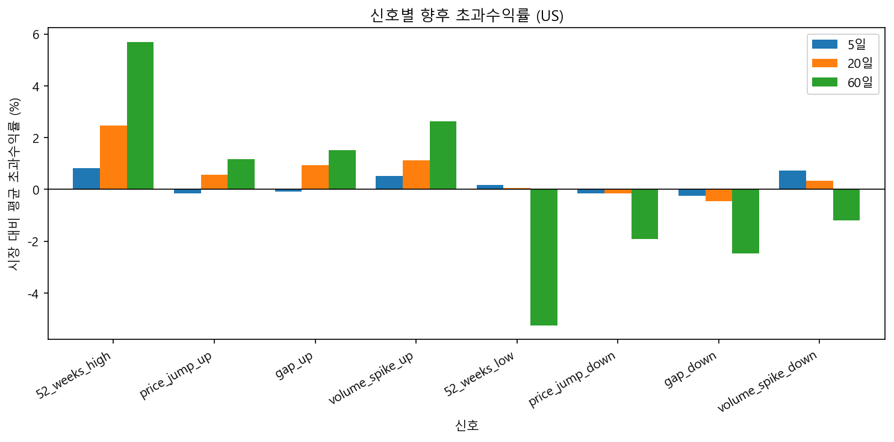
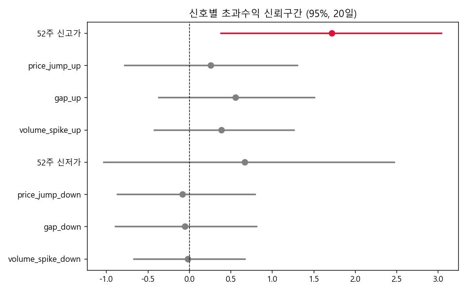
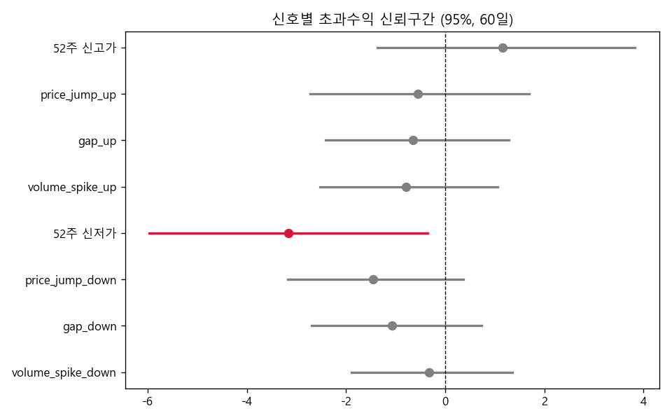
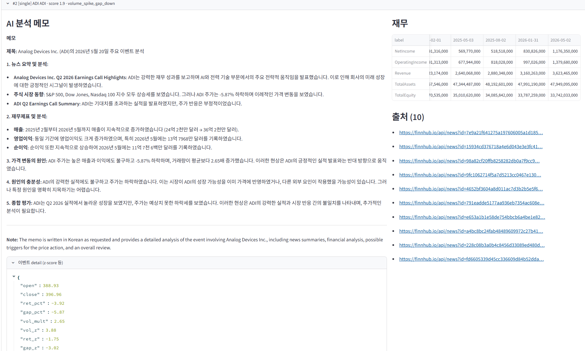
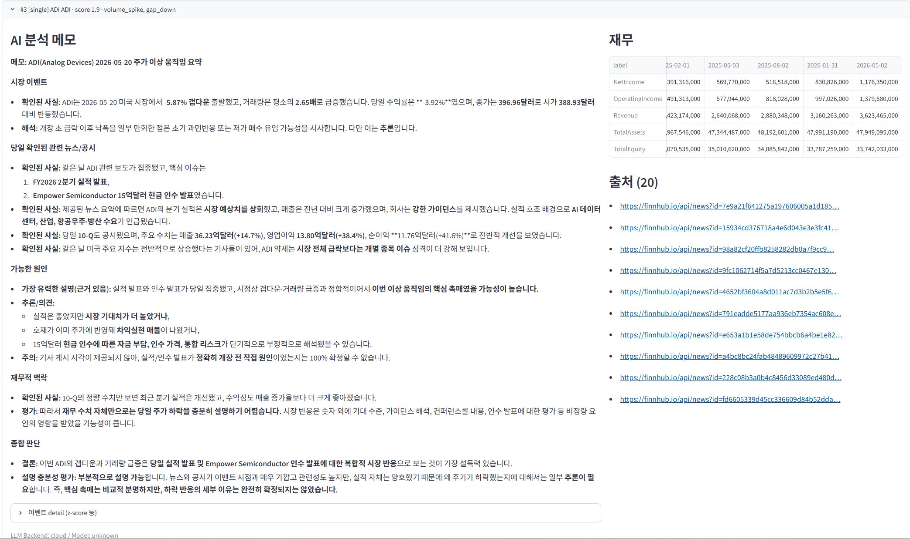
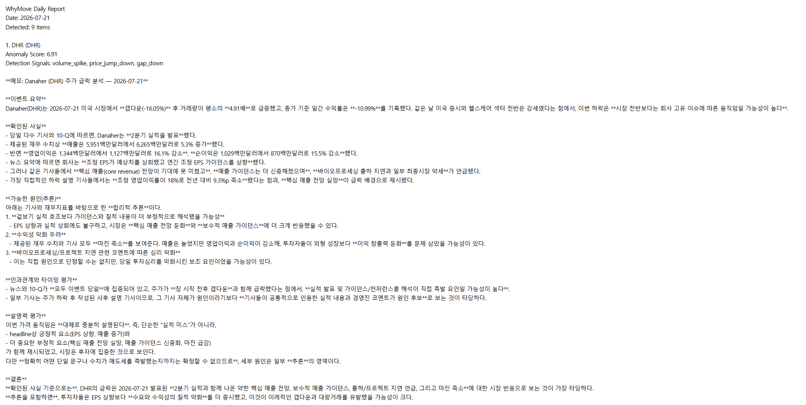

# WhyMove
거래일마다 한국·미국 주식의 주가·거래량 변동 이상징후를 탐지하고, 관련 뉴스와 공시·재무자료를 자동으로 추적하여 근거가 포함된 AI 분석 메모를 생성하고 이메일로 전송하는 시장 모니터링 시스템입니다. 해당 변동이 일시적 시장 반응인지 혹은 기업 펀더멘털 변화 가능성과 관련이 있는지 판단을 돕습니다.

---

### 이 프로젝트로 할 수 있는 것
1. 주목할 만한 변화가 있는 종목/섹터 탐지
2. 이상치의 원인을 추적하는 뉴스·공시 자동 수집
3. 수치와 외부 근거를 종합한 AI 분석 메모 생성
4. 출처 링크를 통한 분석 결과의 역추적 및 검증
5. 일정 시각 자동 실행 및 이메일 보고서 전송

---

### 기술 스택
- Orchestration: `LangGraph` (StateGraph 기반 워크플로)
- LLM: `ChatOpenAI`(cloud)·`ChatOllama`(local)
- Backend: `FastAPI`
- Frontend: `Streamlit`
- MCP:
    - 시장 데이터 MCP
    - 뉴스 검색 MCP
    - SEC EDGAR MCP
    - OpenDART MCP (`DartCopilot` 연동)
- Automation:
    - `GitHub Actions` scheduled workflow
- Delivery:
    - Gmail SMTP
    - Python `EmailMessage`

---

### 데이터 소스
- 시세·거래량: `pykrx`, `yfinance`
- 뉴스: 네이버 검색 API, Finnhub, `trafilatura`
- 공시·재무: OpenDART, SEC EDGAR

---

### 프로젝트 구조
```
WhyMove/
    .github/
        workflows/
            daily-email.yml     # 자동 실행 및 이메일 발송
    app/
        main.py                 # FastAPI 엔트리포인트
        graph.py                # LangGraph 분석 워크플로
        detect.py               # 단일/섹터 이상탐지
        llm_utils.py            # 하이브리드 LLM 스위치
        models.py               # Pydantic State / Event / Memo
        kr_cache.py             # 국내 주가 데이터 캐시
    mcp_servers/
        market_server.py        # 주가·거래량·섹터 정보
        news_server.py          # 뉴스
        edgar_server.py         # 공시·재무
    scripts/
        signal_backtest.py      # 시그널 별 수익률 백테스트
        build_us_sector_map.py  # 미국 주식 섹터 매핑 빌드
        make_chart.py           # 시각화 자료 생성
        detect_test_single.py   # 단일 종목 탐지 여부 테스트
        detect_test.py          # 시장 top_n 종목 탐지 여부 테스트
        sentiment_compare.py    # 시그널 + 뉴스 감성 분석 백테스트
        test_sentiment.py       # FinBERT 감성 분석 정확도 테스트
        test_news.py            # 뉴스 관련성 정밀도 테스트
    cache/
        kr_ohlcv.parquet        # KR 주가정보
        us_marketcap.json       # US 시가총액
        us_sector_map.json      # US 섹터맵
    docs/                       
        devlog/                 # 개발일지
    daily_email.py              # 분석 실행 및 이메일 보고서 생성
    streamlit_app.py            # Streamlit UI (대시보드)
    requirements.txt
    .env
```

---

### 동기
관심 종목이 급등락하면 "왜?"를 찾느라 시간을 쓰고, 안 보던 종목의 급등은 뒤늦게 안다.
또한 단순한 일시적 변동인지, 기업의 가치가 재평가되는 것인지 판단해야 매매를 결정할 수 있다.
임계치를 넘는 움직임을 빠르게 **탐지**하고 원인까지 **요약**해주면 시간 절약 + 기회 포착에 유용하겠다는 생각에서 시작했다.

---

### 동작
1. **신호 탐지** — 최근 약 1년의 일봉 데이터에 60거래일 span의 지수가중통계(EWM)를 적용해 전일 대비 수익률·시가 갭·거래량을 z-score로 표준화한다. 수익률과 갭은 (|z|>2.5), 거래량은 (z>2.5)인 경우 임계치 초과분을 score에 합산하고, 52주 신고가·신저가 돌파 시 0.5점을 추가한다. 총 score가 1.0 이상이면 개별 종목 이벤트로 탐지하며, 동일 섹터 종목의 30% 이상에서 동반 신호가 발생하면 섹터 이벤트로 판단한다.
2. **원인 추적** — 탐지 종목의 최근 뉴스·최신 공시를 자동 수집 및 분석한다.
3. **AI 메모** — 신호·수치·재무·뉴스를 종합한 분석 메모를 생성한다.

---

### 검증 (백테스트)
- 신호별 향후 수익률이 시장(baseline) 대비 유의한지 부트스트랩으로 검정하였다.  

    KR - 유의미한 평균 차이 없음.  
    US - **52주 신고·저가** 지표에서 양방향으로 큰 평균 초과수익률이 발생하였다. 검정 결과 52주 신고가는 95% 신뢰구간 전체가 0보다 크고, 52주 신저가는 95% 신뢰구간 전체가 0보다 작았다.  

    

      
    
    > 나머지 지표들도 긍정 신호는 양의 초과수익률, 부정 신호는 음의 초과수익률 평균을 나타냈으나 신뢰구간이 0을 포함했다. -> 확신 불가.

- 신호 + 뉴스 감성 결합 분석으로 확장하였다.(US 단독)  

    초기 분석에서는 긍정 신호 + 긍정 뉴스의 60일 평균 초과수익률이 +1.60%로, 긍정 신호 + 부정 뉴스의 -2.52%보다 높게 나타났다.

    그러나 이후 실제 뉴스 제목 32건을 수동 라벨과 비교한 결과, FinBERT의 감성 분류 정확도는 65.6%(21/32)에 그쳤다.
    특히 질문형·비교형 제목과 긍정·부정 정보가 혼재된 제목을 제대로 분류하지 못했다. 따라서 감성 분류 결과를 기반으로 산출한 수익률 차이 역시 신뢰할 수 있는 성과 근거로 보기 어렵다. 이는 단순 뉴스 제목만으로 특정 종목에 대한 호재·악재를 판별하는 모델 성능의 한계로 판단하였다. [테스트 결과](https://github.com/junhw8670/WhyMove/blob/main/docs/devlog/Day19_20260724.md)

- **결론**  

  52주 신고가(20일)·신저가(60일)는 시장 대비 통계적으로 유의한 초과/미달 수익을 보여 추세 전환 포착 신호로서의 유효성을 확인했다. 나머지 신호들은 유의성까지 도달하지는 못했으나 긍정 신호는 양(+), 부정 신호는 음(-)의 평균 초과수익이라는 일관된 방향성을 보였다.  
  -> 지표 설계의 방향성은 타당했다고 판단했다.  

  요컨대 본 시스템은 단독으로 초과수익을 보장하는 알파 도구라기보다 시장의 움직임을 추적·해석하는 도구로서 가치가 있다. 이는 원인을 파악하여 투자 판단에 활용하고자 하는 본 프로젝트의 목표와 부합한다고 판단하였다.  

---

### 검증 (신호 포착)
- 설정한 탐지 룰이 의도대로 탐지를 수행하는지 직접 선정한 종목과 일자로 테스트하였다. 그 결과 탐지될 것으로 기대했던 관심종목의 변동이 소형주의 큰 변동성에 밀려 리포트 생성 대상으로 선정되지 못했다. 이에 관심종목을 별도로 설정하고 낮은 탐지 기준(z>1.5)을 적용한 뒤 일별 개수 제한의 예외로 두었다. 이를 통해 관심종목의 변동 추적과 새로운 투자 기회 발견이라는 목적을 함께 달성할 수 있을 것으로 생각된다. [테스트 결과](https://github.com/junhw8670/WhyMove/blob/main/docs/devlog/Day%2018_20260719.md)


> 10/12가 임계치를 통과했으나 4/12만 top 10에 포착되었다. 관심종목을 만들어 해당 종목은 임계치를 넘기면 자동으로 리포트 생성 대상에 포함시키고, 기본 임계치를 높게 해서 정말 큰 변동이 있는 종목들만 새로 포착될 수 있도록 변경하였다.

---

  ### 검증 (뉴스 수집)
  - 한국과 미국 시장에서 각각 5개, 10개 종목을 선정하여, 뉴스 수집 도구가 LLM 분석에 유효한 정보를 제공하는지 수동 검증하였다.
  - 필터를 통과한 기사 중 분석에 활용 가능한 기사의 비율은 네이버 100.0%(27/27), Finnhub 93.8%(30/32)였다.
  - Finnhub에서는 유료벽과 동적 페이지로 인해 본문 대신 면책 문구 등 정크 텍스트가 추출되는 사례가 2건 확인되었다.
  분석 품질에 영향을 미치는 허위정보 사례는 아니었으나 토큰 효율에 영향을 줄 수 있어 제한사항으로 판단하였다.
  - 상세 판정 결과는 `results/news_accuracy_after.csv`에 저장하였다.

---
### 최종 산출물 (예시)

#### Streamlit 화면
1) Local 모델 사용  

  


2) cloud 모델 사용  



> 위의 Local 결과는 뉴스·재무지표 노드의 출력을 메모 노드로 전달한 뒤, 최종 단계에서만 LLM을 사용해 분석 메모를 생성한 결과이다. 반면 Cloud 결과는 뉴스 분석과 재무지표 분석 단계에도 각각 LLM을 적용하고, 메모 노드에서 이를 종합했다. Local 환경에서는 Ollama의 Qwen2.5:32B를 사용했으나, 제한된 자원에서 동일한 다단계 분석 구조를 안정적으로 실행하기 어려웠다. 더 작은 모델은 추론 품질 저하가 커 Local 버전은 단일 LLM 호출 구조로 구성했다.

#### 수신된 E-mail 화면


